# Ultra Raw Converter-0.0.8

## 一、总览

Ultra Raw Converter 是一个基于 Libraw 的 Python warper，Rawpy库以及 imageio 等模块完成的相机 Raw 文件转换软件，使用 PyQt5 完成 GUI.

传统图片处理软件，例如 Adobe Camera RAW、Adobe Lightroom、Capture One 虽可以对相机 Raw 文件进行调整、可以完成 Debayer 并输出图片文件的功能，但均无法适配影视制作的色彩管理流程，无法导出相对无损的高规格、可用于 Scene Referred 的图片文件。在面对 HDR 等高规格制作流程中，对于特定色彩空间、Gamma 输出的限制在后续 DI 流程中有极大的限制。Ultra Raw Converter 支持将 Raw 文件 Debayer，以 ACES、XYZ 等色域，线性 Gamma，批量输出最高 16 bit 的无损 Tiff 文件。同时 Ultra Raw Converter 可用于快速 Debayer 流程，支持曝光线性调整（-2 到 +3 档）、高光 Roll-Off 调整（包括高光重建）、滤波降噪等多种功能，支持多格式（Tiff、Jpeg、Bmp、PNG）格式输出，支持多种常用色彩空间、Gamma.

开发初期使用的 Rawpy 版本为1.17.1 , 因为不支持 ACES 色域，在 Github 上向原作者提交 Issue，遂获得 1.17.2 版本更新，支持了 ACES AP0 色域的输出。

## 二、界面

### 主界面

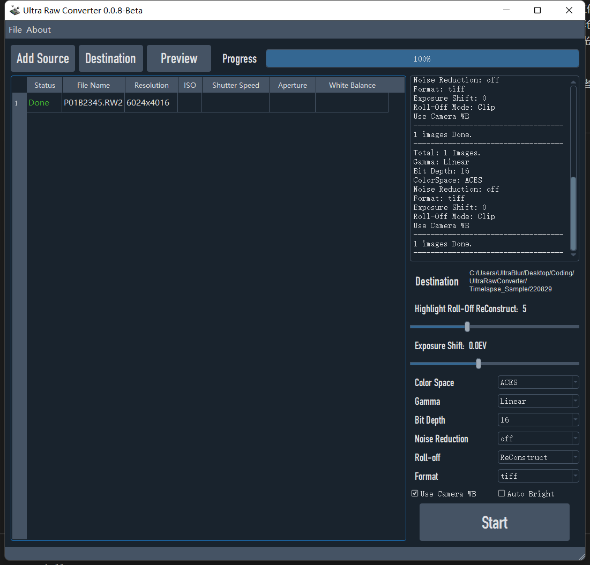

### 功能按钮

Add Source —— 打开文件导入窗口，添加图片文件源（可一次添加多个图片）
Destination —— 打开文件夹选择窗口，选择文件导出目的地
Preview —— 图片效果预览。根据选择的参数，生成一张低分辨率的Jpeg至Cache文件夹，弹出窗口显示图片进行预览。（预览窗口如下）

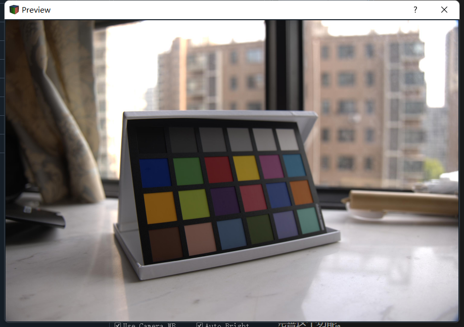

其中预览的图片文件为文件列表中选中行的文件，可同时预览多张图片、多版本。

### 进度条

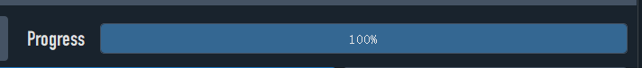

实时更新导出进度。

### 文件列表

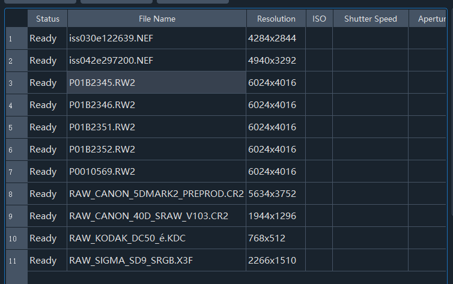

可显示导入文件的状态、文件名、分辨率等信息
	P. S. ISO、快门速度、白平衡、光圈等元数据需要识别 Exif 信息，在后续版本中完善这个功能。

### 日志区

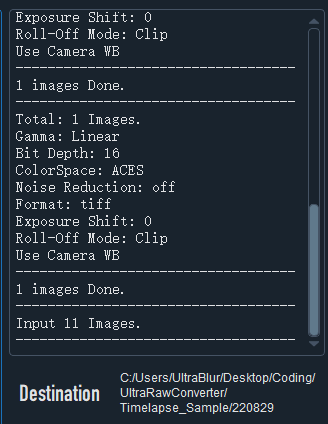

上方为日志区，显示文件日志。具体显示导入图片张数、导出目录、导出参数、完成状态。

下方 Destination，右侧显示导出目录。

### 参数选择以及开始按钮

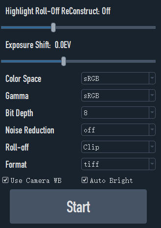

###### Highlight Roll-Off Reconstruct

——默认状态为 Off ，只有当 Roll-0ff 选项卡选择到 ReConstruct 时才能激活，默认数值：5 ，调整范围：3-9

###### Exposure Shift

——默认为 0EV，只有当 Auto Bright 关闭时可激活，调整范围：-2 到 +3 EV，最小调整单位 1/3 EV

###### Color Space 间

——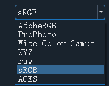支持如图色彩空

###### Gamma

——支持 Linear 以及 sRGB

###### Bit Depth

——文件色深，支持8/16bit 两个选项，具体色深受到导出文件格式影响

###### Roll-Off

###### ——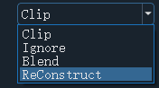

    Clip：裁切溢出高光
	Ignore：不处理溢出高光（溢出部分会出现奇怪颜色）
	Blend：高光平滑过渡
	ReConstruct：高光重建，默认参数5，可通过如上滑块调整

###### Format

——导出格式，可选择 Tiff、Jpeg、PNG、BMP

###### Use Camera WB

——默认开启，选择是否使用相机原始白平衡；如果关闭则软件自动白平衡。

###### AutoBright

——和 Exposure Shift滑块冲突，选择是否自动白平衡

###### Start

——开始按钮

## 三、弹窗、提示和状态栏。

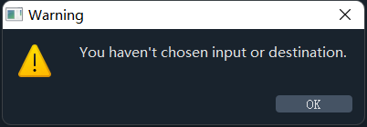
没有选择文件源或者目的地

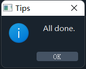
转换完成

#### 状态栏：Ready 就绪，运行时为 Running

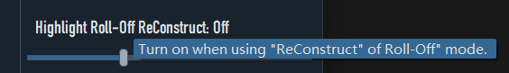

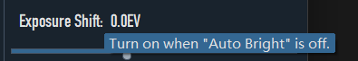

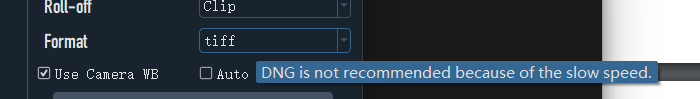

一些亲切的使用提示

#### About 关于

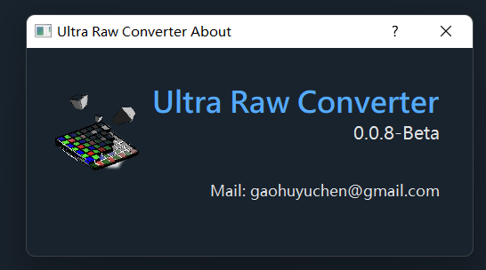

## 四、程序结构

主文件 ——Main.py

文件夹 Window——Ui_Main.py ，Ui_About.py

文件夹 Function——function_rawpy.py , function_exif.py（未完成）

#### Main.py

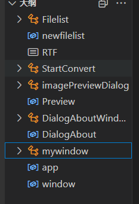
和Ui逻辑功能相关，软件主要运行代码

#### function_rawpy.py

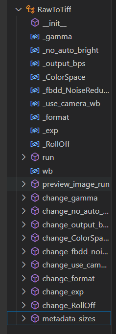

Rawpy主要运行代码，包括参数管理

#### Ui_Main.py、Ui_About.py

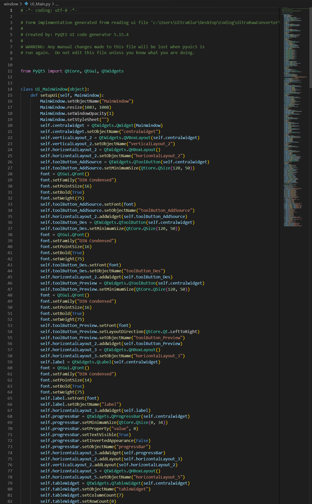

在 Qt Designer 中绘制 UI ，生成的 .ui 文件通过 Vscode 插件转换生成。和 Main.py 动态链接。

## 五、开发日志

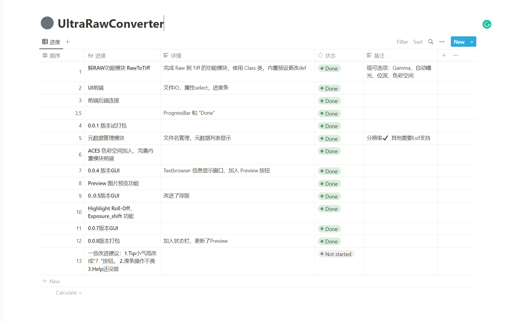

已经开发到了 0.0.8 版本，完成了基本功能的实现、UI美化。

易用性有待提高，以及 Exif 元数据的支持暂时空缺。
